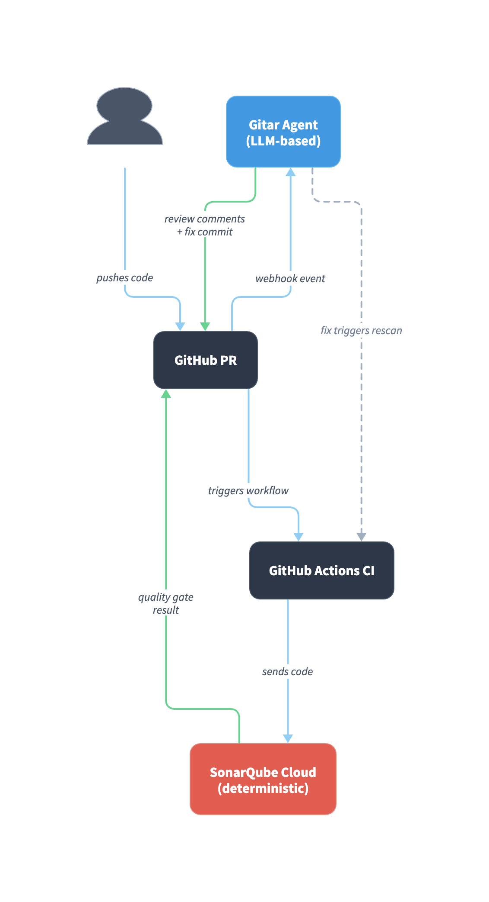
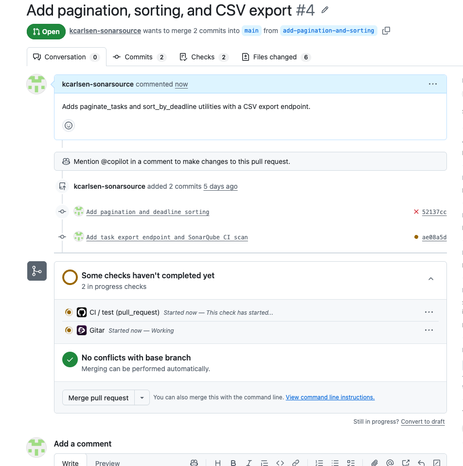
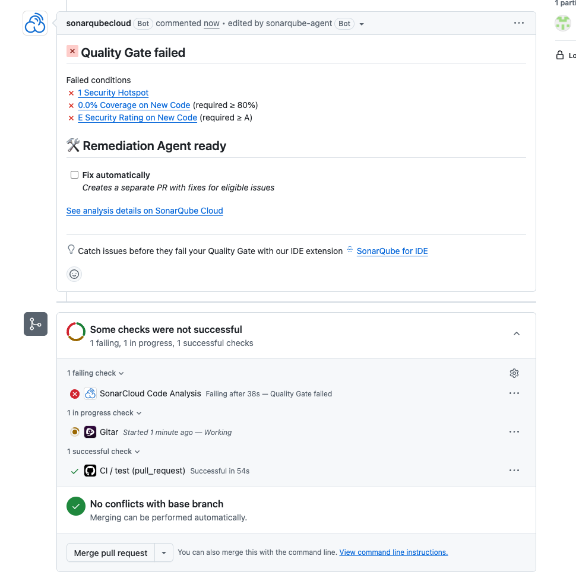
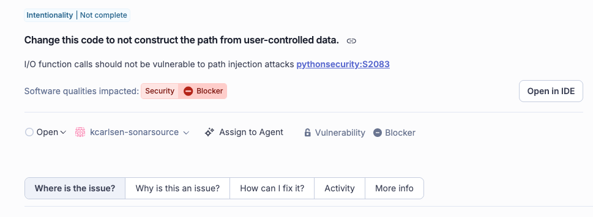
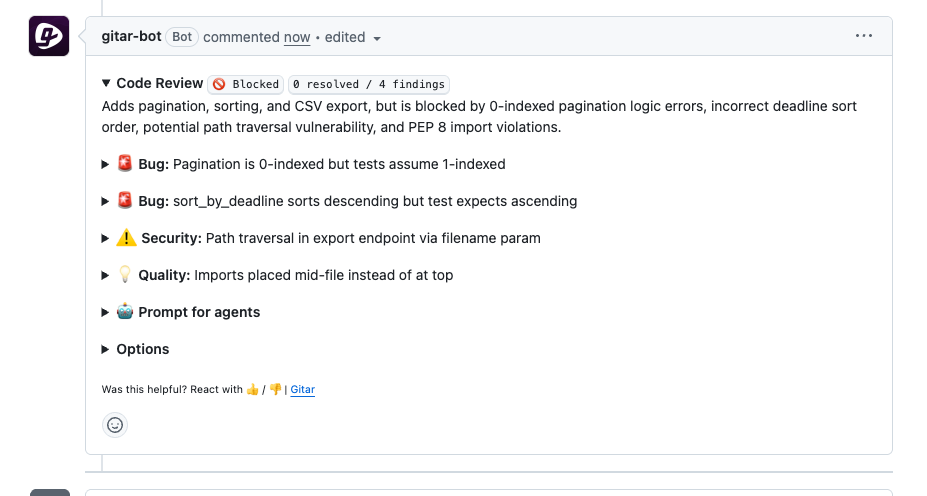
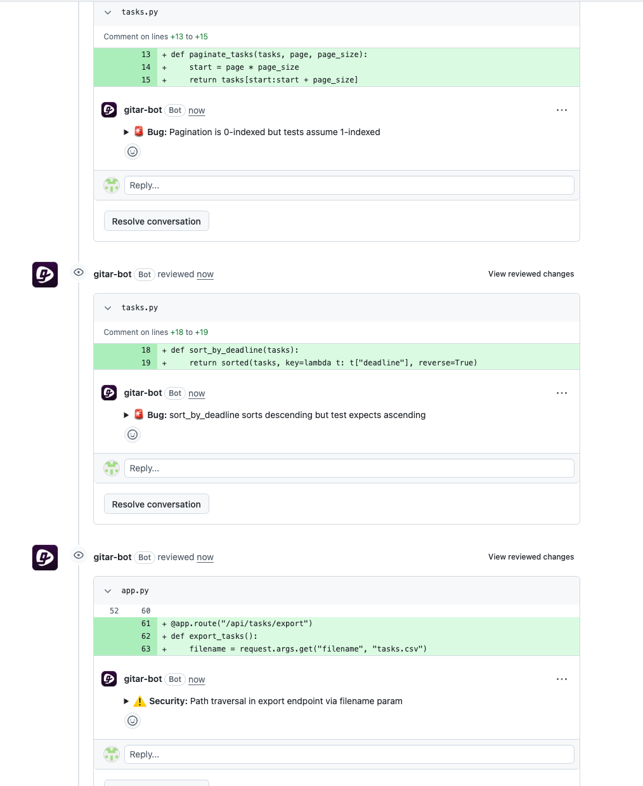
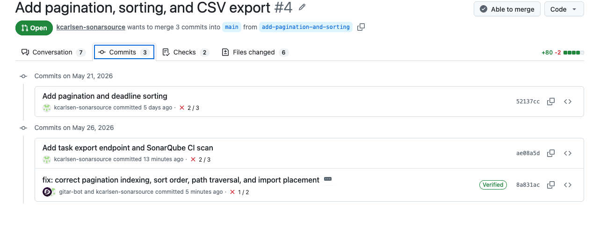
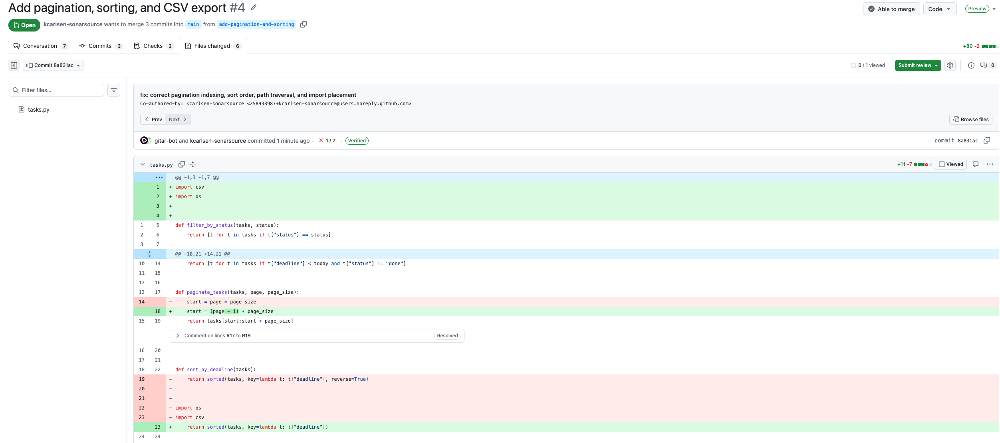
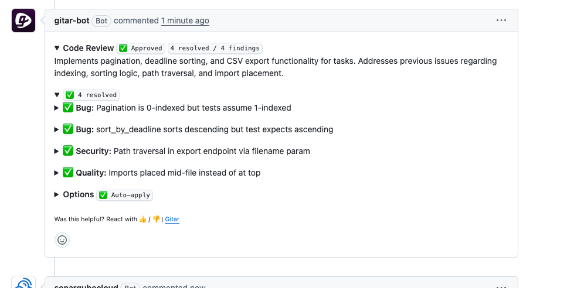
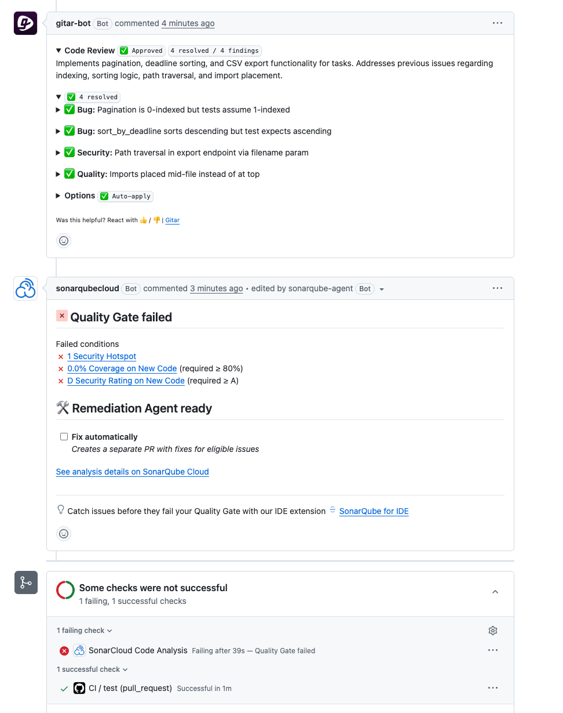

# Multilayered code verification with Gitar and SonarQube Cloud

> Last updated: June 2026
>
> This is a dated preservation of a reviewed blueprint. The recorded demo output reflects its June 2026 environment and may differ by release, project, organization, and entitlement. Check current product documentation before using these instructions in a live environment.

## TL;DR overview

- Pairing [Gitar](https://www.sonarsource.com/products/gitar/) with [SonarQube Cloud](https://www.sonarsource.com/products/sonarqube/cloud/) gives every pull request two independent verification layers: LLM-based review that fixes CI failures, and deterministic analysis that catches security vulnerabilities at zero token cost.
- Both tools independently detect the same path traversal vulnerability through different methods, while each catches issue types the other may not reach.
- Gitar's fix commits trigger automatic SonarQube rescans, so resolved findings clear without manual intervention. The two tools operate as independent, parallel paths on the same pull request.
- After Gitar fixes its findings and approves the PR, SonarQube's quality gate still blocks on security issues the AI never flagged.

## Overview

Two independent verification layers run on a single GitHub repository: Gitar for LLM-based code review and CI auto-fix, and SonarQube Cloud for deterministic static analysis and quality gate enforcement. Neither tool knows about the other. They run on the same PR, catch different classes of problems, and report independently.

Gitar analyzes CI logs and code diffs, then pushes fix commits to the PR branch. [SonarQube](https://www.sonarsource.com/products/sonarqube/) traces data flows through code to detect [security vulnerabilities](https://www.sonarsource.com/resources/library/ai-coding-tools-security-risks/) that do not break tests, then blocks the PR if the quality gate fails. SonarQube's analysis consumes zero LLM tokens.

## When to use AI code review with static analysis

Use this approach when you want CI failures fixed automatically and security vulnerabilities caught before merge without relying on a single detection method. [AI code review](https://www.sonarsource.com/resources/library/what-is-ai-code-review/) catches logic errors and test failures that require understanding intent. Deterministic analysis catches taint flows, insecure configurations, and policy violations the LLM may not flag.

## What you'll see

- Gitar automatically analyzes CI failures and pushes fix commits to the PR branch.
- SonarQube catches security vulnerabilities through taint analysis at zero token cost.
- Both tools independently find the same path traversal vulnerability through LLM code review and data flow analysis.
- The quality gate blocks merge on issues the AI review did not flag.

## Architecture



SonarQube runs as a step inside GitHub Actions CI. When the scan action executes, it sends code to SonarQube Cloud's analysis engine, which traces data flows, applies security rules, and returns a quality gate result that decorates the PR.

Gitar runs outside CI entirely. The GitHub App receives PR events through a webhook, and Gitar's cloud agent analyzes the code diff and CI logs independently. When it pushes a fix commit, CI retriggers, and SonarQube rescans automatically.

The two paths converge on the PR but never intersect. The developer sees Gitar's review comments and approval status alongside SonarQube's quality gate result as two independent assessments.

## Prerequisites

- A GitHub organization with permissions to install GitHub Apps and add secrets.
- A SonarQube Cloud account.
- A Gitar account with the GitHub App installed on your organization. Auto-apply requires a [Gitar Pro plan](https://gitar.ai/pricing). The Core tier includes CI failure analysis and review comments but not fix commits. See the [Gitar quickstart](https://docs.gitar.ai/quickstart) for installation.
- Python 3.12 or later, or adjust the CI workflow version to match your project.

This blueprint uses a Python and Flask demo app with pytest on GitHub Actions. The pattern applies to [languages SonarQube Cloud supports](https://docs.sonarsource.com/sonarqube-server/analyzing-source-code/languages/overview) and repositories on GitHub or GitLab.

## Step 1: Demo repository with failing tests and a hidden vulnerability

The demo repository is a Python and Flask task tracker API. The `main` branch has correct code with passing tests. The `add-pagination-and-sorting` branch introduces two buggy utility functions, three test failures, and a CSV export endpoint with a path traversal vulnerability that has no test coverage.

`paginate_tasks` uses `page * page_size` as the start offset instead of `(page - 1) * page_size`, so page 1 returns the second page of results. `sort_by_deadline` sorts descending when the tests expect ascending. Three tests catch these bugs, but there are none for the export endpoint.

That endpoint takes a user-supplied filename from the request and passes it through `os.path.join` into `open`:

```py
def export_tasks_to_csv(tasks, export_dir, filename):
    filepath = os.path.join(export_dir, filename)
    os.makedirs(export_dir, exist_ok=True)
    with open(filepath, "w", newline="") as f:
        writer = csv.writer(f)
        writer.writerow(["id", "title", "status", "deadline"])
        for task in tasks:
            writer.writerow([task["id"], task["title"], task["status"], task["deadline"]])
    return filepath
```

The route passes `request.args.get("filename")` directly to this function:

```py
@app.route("/api/tasks/export")
def export_tasks():
    filename = request.args.get("filename", "tasks.csv")
    filepath = export_tasks_to_csv(tasks_db, "/tmp/exports", filename)
    return jsonify({"exported_to": filepath, "count": len(tasks_db)})
```

The taint flow crosses two files and three function calls: `request.args.get("filename")` to `export_tasks_to_csv()` to `os.path.join()` to `open()`. On the feature branch, `pytest -v` shows three failures: `test_paginate_first_page`, `test_paginate_second_page`, and `test_sort_by_deadline_ascending`.

## Step 2: SonarQube Cloud scan running in CI

Import the repository into [SonarQube Cloud](https://sonarcloud.io):

1. Click **+**, then **Analyze new project**.
2. Select your GitHub organization and repository.
3. Choose **With GitHub Actions** as the analysis method.

Add `sonar-project.properties` to the repository root:

```properties
sonar.projectKey=<YOUR_ORG>_<YOUR_REPO>
sonar.organization=<YOUR_ORG>
```

Add `SONAR_TOKEN` as a GitHub Actions secret under **Settings > Secrets and variables > Actions**. Generate the token in SonarQube Cloud under **My Account > Security**.

Update `.github/workflows/ci.yml` to run the scan after tests:

```yaml
name: CI

on:
  pull_request:
  push:
    branches: [main]

jobs:
  test:
    runs-on: ubuntu-latest
    steps:
      - uses: actions/checkout@v4
        with:
          fetch-depth: 0

      - uses: actions/setup-python@v5
        with:
          python-version: "3.12"

      - name: Install dependencies
        run: pip install -r requirements.txt

      - name: Run tests
        continue-on-error: true
        run: pytest -v

      - name: SonarQube scan
        uses: SonarSource/sonarqube-scan-action@v8
        env:
          SONAR_TOKEN: ${{ secrets.SONAR_TOKEN }}
```

`continue-on-error: true` keeps the job running when pytest fails, so the SonarQube scan executes. Without it, the job stops on the three test failures and SonarQube never scans. `fetch-depth: 0` gives SonarQube full Git history for accurate new-code detection on PRs. The action references use version tags for readability. See [What to know](#what-to-know-about-sonarqube-and-gitar-ai-code-review) for SHA pinning guidance.

Gitar's dashboard still shows test failures clearly, so nothing is hidden by `continue-on-error`.

## Step 3: Gitar GitHub App active on the repository

If you installed the Gitar GitHub App on all repositories in your organization during the [quickstart](https://docs.gitar.ai/quickstart), the repository is already covered. Otherwise:

1. Go to [app.gitar.ai](https://app.gitar.ai) and click **Install**.
2. Select the repository.
3. Verify that it appears in the Gitar dashboard.

No configuration files are required for CI failure analysis and code review. Gitar activates automatically when a PR opens or receives a push. Leave auto-apply off for now. You will enable it per PR after seeing the initial analysis.

## Step 4: PR open with both tools analyzing

Push the feature branch and open a PR. GitHub Actions CI runs pytest, then the SonarQube scan step. The Gitar GitHub App receives the PR event through a webhook and begins analyzing the code diff and CI logs independently.



## Step 5: Quality gate blocked on security findings

In the demo, the SonarQube quality gate comment appeared about three minutes after the PR opened, before Gitar posted its analysis.

The quality gate fails with an E Security Rating on new code. SonarQube found three issues:

| Rule | Impact | File | Finding |
| --- | --- | --- | --- |
| `pythonsecurity:S2083` | Security, BLOCKER | `tasks.py` | User-controlled data flows into file path operation |
| `python:S5443` | Security, HIGH | `app.py` | Publicly writable `/tmp` directory used for exports |
| `python:S6965` | Maintainability, MEDIUM | `app.py` | Flask route missing explicit HTTP methods parameter |

A security hotspot also fires: `githubactions:S7637` flags the GitHub Actions dependencies for using version tags instead of pinned commit SHAs.





The S2083 finding traces data across two files and three function calls: `request.args.get("filename")` in `app.py` is passed to `export_tasks_to_csv()`, flows into `os.path.join(export_dir, filename)` in `tasks.py`, and reaches `open(filepath, "w")`. The analysis engine traced this through the data flow graph.

## Step 6: Four findings from two independent tools

Gitar's analysis posts shortly after SonarQube's. The dashboard comment shows four findings:

| Category | Finding |
| --- | --- |
| Bug | Pagination is 0-indexed but tests assume 1-indexed |
| Bug | `sort_by_deadline` sorts descending but test expects ascending |
| Security | Path traversal in export endpoint via filename parameter |
| Quality | Imports placed mid-file instead of at top |





Both tools found the path traversal independently. SonarQube detected it through taint analysis, tracing untrusted data from the Flask request parameter through `os.path.join` into `open()` and flagging it as `pythonsecurity:S2083`. Gitar detected the same vulnerability through LLM code review, recognizing unsanitized user input in a file path. Different detection methods found the same vulnerability on the same PR, with SonarQube's detection consuming zero LLM tokens.

Gitar caught the off-by-one pagination bug and the reversed sort direction. SonarQube caught the publicly writable `/tmp` directory and the missing HTTP methods on the Flask route. These are independent assessments, not an integration or a shared quality gate.

## Step 7: Automated fix pushed in one commit

Enable auto-apply by posting this comment on the PR:

```text
gitar auto-apply:on
```

Gitar pushes a single fix commit addressing its four findings. In the demo, the commit landed about two and a half minutes after the command:

- `paginate_tasks` changed `page * page_size` to `(page - 1) * page_size`.
- `sort_by_deadline` removed `reverse=True`.
- `export_tasks_to_csv` added `os.path.basename(filename)` sanitization with a `ValueError` guard.
- Imports moved to the top of the file.







The fix commit triggers CI to rerun. Tests pass. Gitar's dashboard updates to “Approved, 4 resolved / 4 findings.”

## Step 8: Green CI and AI approval, quality gate still blocked

SonarQube rescans on Gitar's fix commit. The path traversal finding, `pythonsecurity:S2083`, clears because `os.path.basename()` resolved the taint flow. The Security Rating improves from E to D, but the quality gate still fails.

| Finding | Status after fix |
| --- | --- |
| `pythonsecurity:S2083`, path traversal | Closed |
| `python:S5443`, publicly writable `/tmp` directory | Open |
| `python:S6965`, missing HTTP methods on route | Open |
| `githubactions:S7637`, unpinned action dependencies | Unreviewed hotspot |
| 0% coverage on new code | No tests for the export endpoint |



Gitar reviewed the code, fixed every issue it found, and approved the PR. CI passes. SonarQube's quality gate blocks on issues the LLM never flagged: a publicly writable export directory, a Flask route without an explicit HTTP methods declaration, an unreviewed supply-chain hotspot in the CI configuration, and zero test coverage on a new endpoint that handles user input.

Green CI and AI approval do not mean merge-ready.

## How do you confirm SonarQube and Gitar are both active on a pull request?

Both layers are active on every PR to the demo repository. To confirm on a new PR, push a code change to a feature branch, open a PR, and check that the SonarQube quality gate comment and Gitar dashboard comment both appear within a few minutes.

For ongoing use, decide whether auto-apply should default to on through the organization-level Gitar dashboard, or remain opt-in per PR through the `gitar auto-apply:on` comment.

The configuration from the setup steps is:

- `.github/workflows/ci.yml`, with `continue-on-error: true` on tests and the SonarQube scan step.
- `sonar-project.properties`, with your organization and project key.
- `SONAR_TOKEN`, stored as a GitHub Actions secret and not committed.
- No Gitar configuration files are needed in the repository.

## What to know about SonarQube and Gitar AI code review

`continue-on-error: true` masks test failures in the GitHub Actions job, although Gitar's dashboard still shows them. If your workflow needs the overall job to fail on test failures while still running the SonarQube scan, split them into separate jobs that trigger on the same events.

SonarQube and Gitar do not share findings or deduplicate. If both tools find the same issue, you see it reported twice in different formats. Sonar [acquired Gitar](https://www.sonarsource.com/company/press-releases/sonar-acquires-gitar/) in May 2026, but the June 2026 demo showed independent products with no shared quality gate or dashboard.

Gitar's fixes trigger SonarQube rescans automatically when the fix commit causes the CI workflow to run again. If the fix resolves a SonarQube finding, it clears on rescan.

The reviewed blueprint states that SonarQube Cloud's [free tier](https://www.sonarsource.com/plans-and-pricing/sonarcloud/) supports PR decoration for pull requests targeting the main branch, while custom quality gates and PR analysis on non-main target branches require a [Team plan](https://www.sonarsource.com/plans-and-pricing/sonarcloud/) or higher. Confirm current plan entitlements before use.

Pin GitHub Actions dependencies to commit SHAs rather than version tags. The `githubactions:S7637` hotspot flags `actions/checkout@v4` and `actions/setup-python@v5` because version tags can be repointed after a supply-chain compromise. [CVE-2025-30066](https://github.com/advisories/ghsa-mrrh-fwg8-r2c3) demonstrated this risk with the `tj-actions/changed-files` action.

Gitar supports CI providers beyond GitHub Actions. This blueprint uses GitHub Actions, while the reviewed source states that Gitar CI failure analysis also supports GitLab CI, Buildkite, CircleCI, and Bitrise. Confirm current provider support in Gitar documentation before use.

## Next steps for SonarQube and Gitar

Deterministic analysis catches issues that LLM review can miss, and LLM review catches logic errors that deterministic analysis may not cover. Running both layers on every PR gives developers independent assessments before merge.

- [Gitar: CI analysis and fixes](https://docs.gitar.ai/features/ci-analysis-and-fixes)
- [Gitar: custom review instructions](https://docs.gitar.ai/features/code-review)
- [SonarQube Cloud: quality gate configuration](https://docs.sonarsource.com/sonarqube-cloud/standards/quality-gates/)
- [Sonar acquires Gitar](https://www.sonarsource.com/company/press-releases/sonar-acquires-gitar/)
